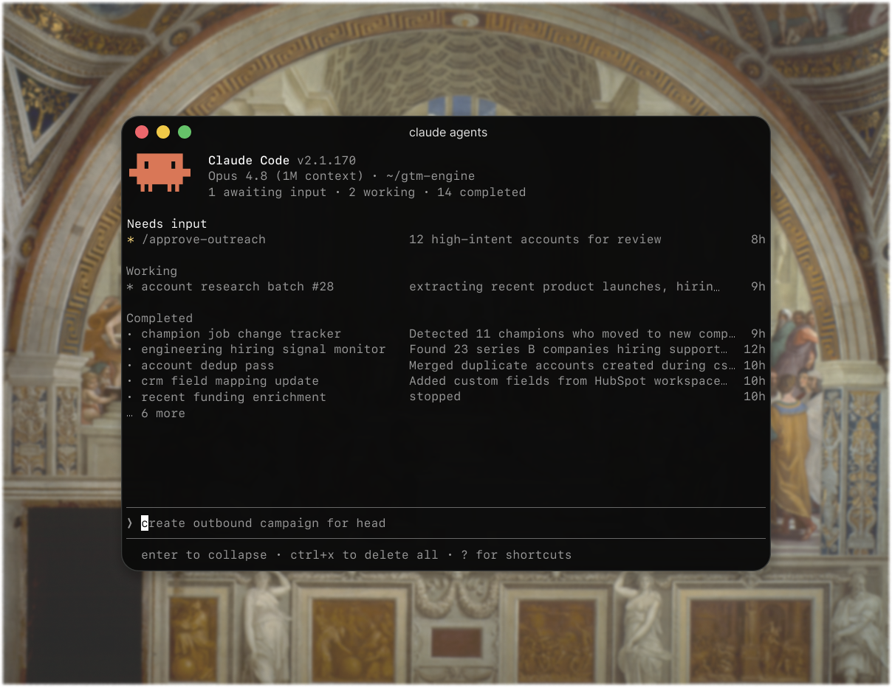

# GTM Engine

<p align="center">
  
</p>

your GTM team is a folder of python scripts and a markdown file describing your business. open it in claude code, answer some questions, ship campaigns.

**this is the sales / marketing / content stack you actually own.**

no SaaS subscriptions, no data lock-in, no per-seat pricing. you bring an Anthropic key and an Apify token. claude code drives everything.

## what it does

6 workflows that cover most of GTM:

| workflow | what it does | output |
|---|---|---|
| linkedin outreach | find leads, scrape their posts, write personal DMs | google sheet of leads + drafted messages |
| email outreach | enrich a list of companies by buying signal, write personalized cold emails | csv ready for instantly / smartlead |
| competitor analysis | research 12 dimensions of every competitor | filled-in google sheet (firmographics, founders, GTM, scoring) |
| content idea finder | scan twitter + HN daily, cluster into post ideas | 5 daily ideas, classified by genre + platform |
| linkedin comment helper | surface LinkedIn posts worth commenting on | ranked list with suggested takes |
| blog builder | research a topic deeply, draft a blog post | full article + sources |

## how to use it

```bash
git clone https://github.com/akshathakurr/gtm-engine
cd gtm-engine
claude "help me get started"
```

that last line opens claude code and kicks things off on its own — you get a welcome and a few questions, no guessing what to type.

claude code does the rest: it sets up your files, walks you through your keys, interviews you about your business, fills in your context, and shows you the workflows you can run. that's the whole UX. no python required.

don't have claude code yet? install it first — [claude.com/claude-code](https://claude.com/claude-code). already inside claude code, or want to start it yourself? just say `help me get started`.

if you'd rather run things directly, every workflow has its own README with the exact `python -m ...` commands.

## what you'll need

- **an AI brain — a claude subscription, a chatgpt plan, or an anthropic api key.** the thinking (scoring, classifying, copywriting) runs on whichever you have; no api key required if you're on a subscription. gtm-engine picks the right one for where you opened it: inside claude code / the claude desktop app it uses your claude plan, inside the codex app (full-access mode) it uses your chatgpt plan, and from a plain terminal it uses your api key. override anytime with `GTM_BRAIN=claude|codex|api`.
- **anthropic api key** *(only if not using a subscription)* — ~$1–5 per workflow run depending on which one. [console.anthropic.com](https://console.anthropic.com)
- **apify token** — for LinkedIn / Twitter / review scraping. pay-per-run, usually $0.50–$3 per workflow. [apify.com](https://apify.com)
- **web-search key — exa *or* parallel** *(optional)* — for web research. needed by competitor analysis, blog builder, and both outreach workflows. either one works; set both and exa is primary with parallel as automatic backup. [exa.ai](https://exa.ai) / [platform.parallel.ai](https://platform.parallel.ai)
- **firecrawl key** *(optional)* — for competitor analysis only. reads JS-heavy pages (pricing, case studies) the basic scraper can't. free tier (1,000 pages/mo) is plenty; without it, those pages just fall back to the basic scraper. [firecrawl.dev](https://firecrawl.dev)
- **google account** *(optional)* — most workflows can write to a google sheet. csv mode works if you'd rather not.

cost-per-run is in each workflow's README.

## run it on your subscription instead of api credits

the whole engine can think on the plan you already pay for:

- **claude pro/max** — one-time: run `claude setup-token`, sign in with the account that holds the plan, and paste the printed token into `.env` as `CLAUDE_CODE_OAUTH_TOKEN=…`. workflows launched with `GTM_BRAIN=claude` (or from inside claude code, where it's the default) bill your plan, not the api.
- **chatgpt plus/pro** — one-time: run `codex login` and sign in with your chatgpt account. workflows launched with `GTM_BRAIN=codex` (or from inside the codex app in full-access mode, where it's the default) bill your chatgpt plan.

scrapers (apify / exa / parallel / apollo) still use their own keys — subscriptions only replace the anthropic api spend. guardrails are built in: if a run would silently bill the wrong thing (a stray api key, an org login with no subscription, a sandboxed codex session), it stops and tells you the exact fix.

## why this exists

most GTM tools are subscription products that own your data, your prospect list, and your messaging. you pay $200/seat/month for software that does what a smart prompt and a scraper could do — and you can't take any of it with you when you leave.

this is the inverse: workflows you can read, modify, fork, and run on your own infrastructure with your own keys. when claude gets better, this gets better. when you change products, you edit a markdown file.

claude code makes the whole thing usable without writing python. your "team" is a folder.

## what's inside

```
context/
  context.md.example       the questionnaire claude code walks you through
  context.md               your business — product, ICP, competitors, tone of voice (gitignored)

workflows/
  linkedin_outreach/
  email_outreach/
  competitor_analysis/
  content_idea_finder/
  linkedin_comment_helper/
  blog_builder/

scrapers/                  single-source data fetchers (LinkedIn, Twitter, G2…)
skills/                    reusable claude prompt modules
```

every workflow folder has its own README — open it for the full details.

## license

MIT
